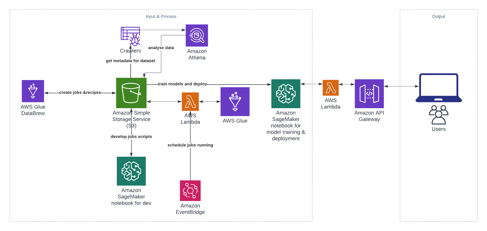

### Introduction of Project
#### 1.Background
Instacart is excited to announce their first public dataset release, “The Instacart Online Grocery Shopping Dataset 2017”. This anonymized dataset contains a sample of over 3 million grocery orders from more than 200,000 Instacart users.

For each user, they provide between 4 and 100 of their orders, with the sequence of products purchased in each order. They also provide the week and hour of day the order was placed, and a relative measure of time between orders.

#### 2.Purpose
They hope the machine learning community will use this data to test models for predicting products that a user will buy again, try for the first time or add to cart next during a session.

Instacart currently uses XGBoost, word2vec and Annoy in production on similar data to sort items for users to “buy again”:

and to recommend items for users while they shop:

#### 3.Data
The dataset is provided as-is for non-commercial use, and can be downloaded from S3 at: https://www.instacart.com/datasets/grocery-shopping-2017 and is subject to Instacart Terms and Conditions.

#### 4.Plan
We will firstly create a data lake on AWS, then create an automated large data processing pipeline using AWS as well as Big Data Engines, and finally create a machine learning model in R to forecast consumer behaviours and boost reorder sales.

#### 5.Technique
- Data Modelling (ER Diagram and Relational Model)
- AWS services (S3, Glue crawler, Glue studio, Glue DataBrew, Lambda, Athena, EventBridge, SageMaker)
- Version Control and CICD (Git, Github)
- Infrustracture as Code (Git Action)
- Big Data Processing (Spark)
- Machine Learning Models (XGBoost, Random Forrest) 
